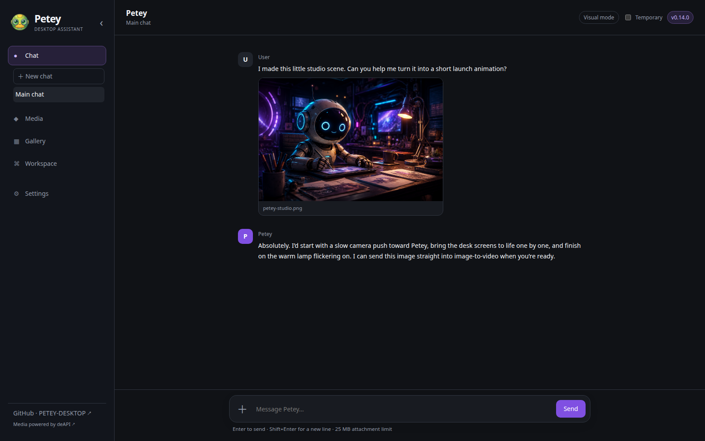
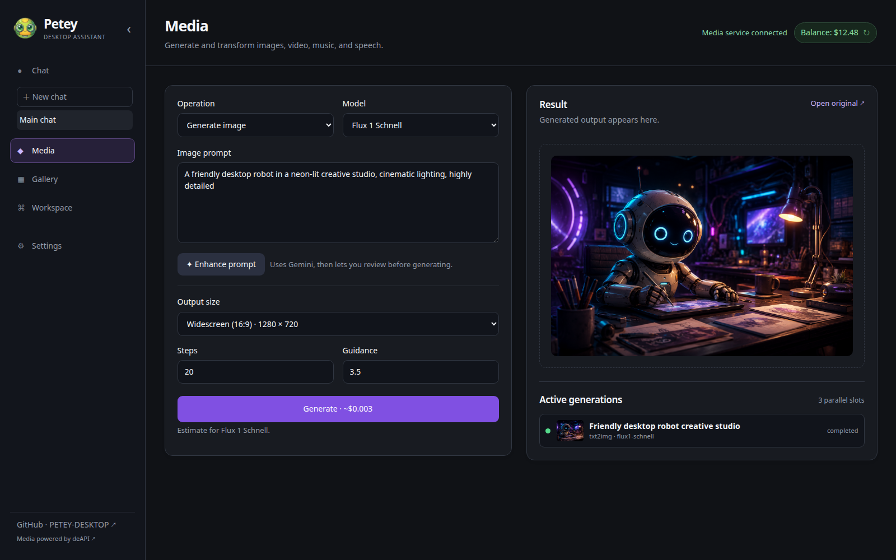
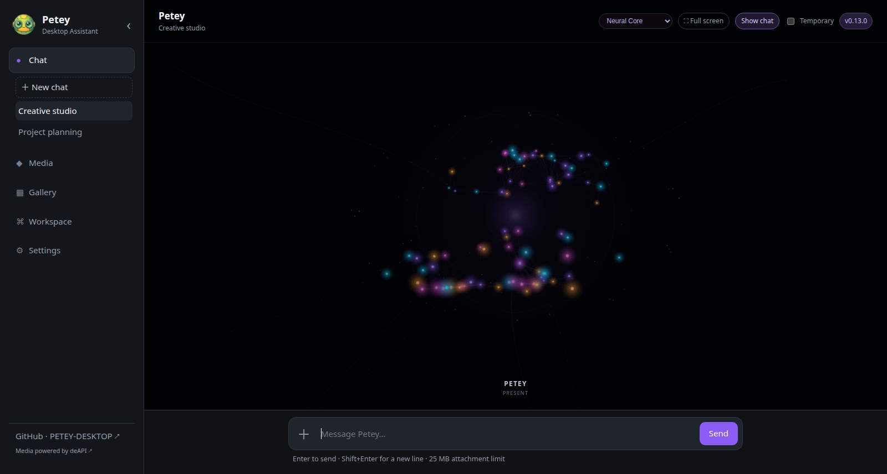

# PETEY Desktop

Current release: **v0.13.0**

PETEY is a standalone desktop AI assistant with local conversations, configurable
personality, universal SQLite memory, RAG document management, deAPI media tools,
and an approval-gated project workspace.

## Preview



| Media studio | Audio-reactive visual mode |
| --- | --- |
|  |  |

## Character creation and roleplay

PETEY can be shaped into an original character, narrator, companion, game master,
or collaborative writing partner—not just a general-purpose assistant. Customize
the character's name, role, tagline, behavior, speaking style, and voice, then save
the complete character-and-voice setup in one of five persona slots.

- Keep separate chats for different characters, campaigns, worlds, or storylines.
- Add lore, character sheets, setting notes, and campaign documents to the local
  RAG library so a character can retrieve relevant details while you play.
- Use saved memory to maintain continuity across sessions, or enable Temporary
  mode for scenes that should not affect the character's ongoing history.
- Talk naturally with push-to-talk, an always-on microphone, or wake-name mode,
  and let the selected voice read the character's responses aloud.
- Use Visual Mode for a voice-reactive, distraction-free performance view.
- Pair roleplay with media tools to create character art, locations, music, voices,
  and animated scenes from the same desktop application.

Because the chat provider is selectable, a character can run through Gemini,
OpenAI, or a compatible local model depending on the desired quality, privacy,
speed, and hardware setup.

## Highlights

- Gemini, OpenAI, LM Studio, Ollama, and other OpenAI-compatible chat providers
- Local SQLite conversation memory with configurable local or hosted embeddings
- Temporary chats that do not read or write memory
- Built-in personality templates, editable system prompts, and five persona-and-voice slots
- RAG uploads, retrieval testing, vector rebuilding, and local database controls
- Parallel image, video, music, speech, background-removal, and upscale jobs
- Streaming Gemini text to speech with OpenAI fallback, named voices, and delivery direction
- Per-reply Speak controls and optional automatic playback for new chat responses
- Push-to-talk, always-on microphone, and wake-name input with deAPI transcription and Gemini fallback
- Keyboard Space push-to-talk and four audio-reactive neural-network chat views
- F11 visual fullscreen with progressive captions during Petey's spoken replies
- Real deAPI progress, provider status, live previews, balance, and a local gallery
- Per-operation media prompt drafts that remain available across app restarts
- Conversational image generation through modular model tools
- Gemini image inspection with an independently selectable vision model
- Visual thumbnail browser for selecting source images
- Multiple saved chats, UI scaling, collapsible navigation, and always-on-top mode
- Approved-folder IDE with a file tree, editor, command console, and reviewable AI edits

PETEY runs a loopback-only Flask server inside a pywebview desktop window. If a
native backend is unavailable, the launcher can open the same interface in your
browser.

## Requirements

- Python 3.12 or newer
- FFmpeg for browser-compatible generated-video previews
- A language-model provider: Gemini, OpenAI, or a local OpenAI-compatible server
- A Gemini API key if you want image inspection, Gemini speech, or transcription fallback
- A deAPI key if you want media generation or low-cost microphone transcription

## Install and run

```bash
git clone https://github.com/bizzomephisto/PETEY-DESKTOP.git
cd PETEY-DESKTOP
python -m venv .venv
source .venv/bin/activate
pip install -r requirements.txt
cp .env.example .env
python run_desktop.py
```

On Windows, activate the environment with `.venv\Scripts\activate`. For
browser-based development, run:

```bash
python run_desktop.py --browser
```

On Linux, the requirements install the PySide6 backend for pywebview. Do not run
`pip install gi`; PyGObject is supplied through Linux distribution packages.

Install PETEY Desktop in your Linux application menu with:

```bash
python run_desktop.py --install-shortcut
```

Application artwork is available under `assets/icons/` as a transparent PNG
master, Linux PNG, Windows ICO, and macOS ICNS file.

Provider keys and models can be configured from **Settings**. Values saved there
are stored in PETEY's platform application-data directory. Environment variables
from `.env` are also supported.

## Local data and privacy

PETEY stores its installation identity, settings, memory database, and generated
gallery in the platform application-data directory—not in this repository. Use
temporary chat when a conversation should not be retained.

When a hosted chat or embedding provider is selected, relevant prompts, selected
workspace-file context, or memory text are sent to that provider. Local-provider
mode keeps those model requests on the configured local endpoint. Chat image
attachments are sent to the independently selected Gemini vision model, and its
text description is passed to the active chat provider. Microphone activity is
detected locally; completed utterance clips are sent to deAPI for transcription,
with Gemini used only when configured directly or as a fallback. Recordings are not
stored in the gallery or memory. Media-generation requests are sent to deAPI.

## Workspace safety

PETEY's file tools are restricted to folders you explicitly approve. Proposed AI
edits display a diff and remain inert until approved. Commands also require an
explicit approval and stop after 60 seconds.

Approved commands still run with your operating-system user permissions. Folder
approval constrains PETEY's built-in file operations; it is not an operating-system
sandbox for arbitrary code.

## Development

For coding agents, start with [AGENTS.md](AGENTS.md), the compact architecture,
task-to-file map, extension guide, and validation reference. Many agents load this
root-level filename automatically. For any other tool, paste:

> Read `AGENTS.md` in the project root first, then implement my request. Use its
> task-to-file map to inspect only relevant code and tests; update it if your
> changes alter the documented architecture or workflows.

Run the test suite with:

```bash
python -m unittest discover -s tests -v
```

Core layout:

- `run_desktop.py` — desktop launcher and native-window bridge
- `petey/assistant.py` — provider-neutral conversation service
- `petey/desktop_memory.py` — local SQLite memory and RAG store
- `petey/desktop_state.py` — installation settings and saved chats
- `petey/deapi_client.py` — deAPI transport and progress polling
- `petey/media_jobs.py` — concurrent generation queue and gallery capture
- `petey/workspace.py` — approved-folder file and command operations
- `petey/tools/` — permission-aware model tool registry and capability modules
- `web/desktop_app.py` — loopback Flask API
- `web/templates/desktop.html` and `web/static/desktop.*` — desktop interface
